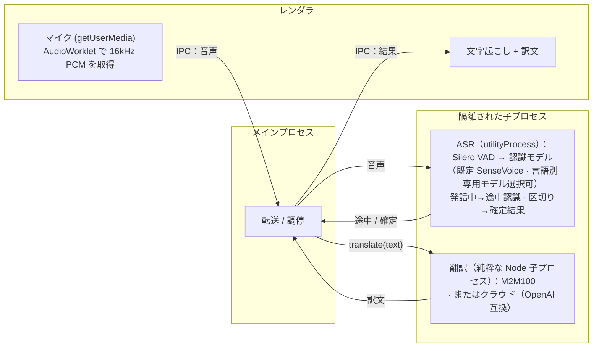

<p align="center">
  
</p>

# Realtime Translator

> macOS・iOS・ブラウザ向けのローカル・リアルタイム音声文字起こし＆翻訳——音声もテキストも端末に留まります（クラウド翻訳は任意）。

[English](README.md) · [简体中文](README.zh-CN.md) · **日本語** · [한국어](README.ko.md)

ブラウザですぐに試せます：**https://baijunjie.github.io/realtime-translator/**

## 機能

- リアルタイムのマイク文字起こし：中国語 / 日本語 / 英語 / 韓国語（自動判定、または設定で認識言語を固定——固定すると短い発話での言語誤判定を大きく減らせます）
- 認識モデルを選択可能：SenseVoice（多言語、全プラットフォーム既定）に加え、Paraformer（中国語）・ReazonSpeech（日本語）・Parakeet（英語）の単言語専用モデル 3 種（macOS、Web でも実験的に利用可）
- ライブ字幕——話している間に途中結果を表示し、発話区切りで確定
- **母語ドリブン**——初回起動で母語を選択（中国語、日本語、英語、韓国語）；UI 全体が母語で表示され、翻訳をオンにすると他の言語はすべて母語に翻訳（中国語の訳文は簡体字に統一）。認識言語が**自動**のときは、母語の発話をセッション内で直近に聞き取った他言語へ逆翻訳します
- 音源を切り替え可能（macOS）：マイク、またはシステム音声（Mac が再生中の音を取り込む、macOS 14.2 以降）；Web / iOS はマイクのみ
- 翻訳エンジンを切り替え可能：
  - **ローカル**（既定）：端末上で実行——ダウンロード後はオフラインで動作し、テキストは端末外に出ません。macOS は M2M-100（軽量、約 640MB、既定）または M2M-100 1.2B（高品質、約 1.5GB）を選択可；Web は M2M-100；iOS は Apple の Translation フレームワーク
  - **クラウド**（任意）：OpenAI 互換の任意エンドポイント（設定で Base URL / API Key / モデルを入力；キーは端末にのみ保存）——有効にするとテキストは第三者に送信されます
- 会話のアーカイブ——セッションを保存して後で再表示
- 設定：母語、認識言語と認識モデル、音源、文字サイズ、テーマ、翻訳方式；「モデルの管理」タブで各モデルの確認 / ダウンロード / 削除（最下部にビルドバージョンを表示）
- モデルはオンデマンドでダウンロード——「録音開始」を押した時（または設定で未ダウンロードのモデルを選んだ時）に確認ダイアログ（モデル名とサイズを表示）が出て、確認するとダウンロードがバックグラウンドで実行（複数モデルは並行ダウンロード）され、UI は操作可能なままです。「モデルの管理」では各ダウンロード中のモデルにインラインのプログレスバーとキャンセル（✕）ボタンが表示される——キャンセルすると停止し、部分的なダウンロードが削除されます。ダウンロード済みのモデルはアプリ起動時にプリロードされ、「録音開始」で即座に録音が始まります
- CPU のみでリアルタイム動作（Apple Silicon 実測 RTF ≈ 0.03）、GPU 不要

## 使い方

1. **初回起動**——オンボーディング画面で母語を選択。
2. **録音開始**をクリック——選んだ認識モデルが未ダウンロードなら、まず確認ダイアログ（モデル名とサイズを表示）が出ます。確認するとプログレスダイアログが表示され、モデルの準備ができたら自動で録音が始まります。そのダイアログから本回の録音をキャンセルできますが、ダウンロードはバックグラウンドで続行します。話すと字幕がリアルタイムに表示。
3. 設定で**翻訳方式**（ローカルモデル / クラウド / オフ）を選ぶと各行の下に母語訳が表示。ローカル翻訳モデルの初回有効化時も、同じダウンロード確認ダイアログ（例：M2M-100、約 640MB）が先に出ます。
4. **⚙ 設定**で母語・認識言語と認識モデル・音源・文字サイズ・テーマ・翻訳方式（およびクラウド認証情報）を変更；「モデルの管理」タブで各モデルの確認・ダウンロード・削除ができます。

マイクやシステム音声へのアクセスを要求する前に、アプリがアプリ内で用途を説明します。その後 OS が許可ダイアログを表示します。以前に拒否した場合は、ワンタップで該当するシステム設定画面を開けます。

## プロジェクト構成

**pnpm ワークスペース monorepo**——共有ロジック/UI、プラットフォームごとに 1 パッケージ。3 つのプラットフォームはすべて**同じ `@rt/ui`** を描画し、違いは注入される `AppBridge` だけです：

- `packages/core`（`@rt/core`）——プラットフォーム非依存の TS：ドメイン型、設定/アーカイブ、翻訳（`Translator` + クラウド + 中国語の簡体字正規化）、ASR とローカル翻訳のマルチモデルレジストリ、能力ブリッジ `AppBridge`。
- `packages/ui`（`@rt/ui`）——共有 Vue 3 UI；注入された `AppBridge` 経由でのみプラットフォームに触れる（`window.api` 直参照なし）。
- `apps/macos`（`@rt/macos`）——Electron アプリ；`AppBridge`（録音・fs ストレージ、ASR は utilityProcess、翻訳は純粋な Node 子プロセス）を実装し、`@rt/ui` をホスト。
- `apps/ios`（`@rt/ios`）——Capacitor アプリ（実動作）；ネイティブプラグインが端末上で sherpa-onnx を実行して認識（iOS xcframework）、端末上翻訳は Apple の Translation フレームワーク（iOS 18+）。`apps/ios/native-plugin/INTEGRATION.md` 参照。
- `apps/web`（`@rt/web`）——インストール可能なブラウザ **PWA**；ASR は単一スレッドの WebAssembly を Web Worker で実行（sherpa-onnx）、ローカル翻訳は Transformers.js（M2M100）を Web Worker で実行、ストレージは IndexedDB。公開先 https://baijunjie.github.io/realtime-translator/ 。
- `assets/`——共有ブランド素材（`icon.svg` / `icon.png`）。各アプリがここから自分のアイコン形式を生成。

## 開発

**pnpm** が必要。Vite + Vue 3 + Naive UI、すべて TypeScript（macOS は electron-vite を使用）。

```bash
pnpm install
pnpm dev                    # macOS アプリをホットリロードで起動（→ @rt/macos）
pnpm --filter @rt/web dev   # ブラウザ PWA の開発サーバを起動（→ @rt/web）
```

iOS は `apps/ios/native-plugin/INTEGRATION.md` を参照（ネイティブプラグインを Capacitor iOS ホストに組み込む必要があり、Xcode ツールチェーンが必須。Translation フレームワークは実機が必要）。

macOS / Web では、認識モデルもローカル翻訳モデルもオンデマンドでダウンロードします：初めて「録音開始」を押した時、または設定で未ダウンロードのモデルを選んだ時に確認ダイアログが出てからダウンロードが走ります。ダウンロードはバックグラウンドで実行されます（「モデルの管理」にインラインプログレスバー + キャンセルあり）。

その他：`pnpm build`、`pnpm type-check`。パッケージ単位：`pnpm --filter @rt/macos <script>`（例 `clean`、`test-translate`）。

### パッケージング（macOS）

```bash
pnpm dist        # ビルド + electron-builder → apps/macos/release/*.dmg（arm64）
pnpm dist:dir    # 展開済み .app のみ（高速、デバッグ用）
```

生成物は現在**未署名**です——開くには右クリック →「開く」（または app に `xattr -dr com.apple.quarantine` を実行）。一般配布には Apple Developer ID で署名・公証してください。モデルは同梱されず、初回使用時にユーザーデータ領域へダウンロードされます。

### Web（PWA）

公開先 **https://baijunjie.github.io/realtime-translator/**——インストール可能で、初回読み込み後はオフラインで動作します（モデルとアプリシェルをキャッシュ）。

- ASR は **単一スレッドの WebAssembly** を Web Worker で実行（sherpa-onnx）——COOP/COEP ヘッダ不要なので GitHub Pages で無料ホスティングできます。
- モデルはオンデマンドで取得します：GitHub Release 資産は CORS ヘッダを返さないため、ブラウザは認識モデルも翻訳モデルも上流の HuggingFace（オプションのミラーも含む）から取得し、Silero VAD はアプリと同一オリジンに同梱のままで、Cache Storage にキャッシュ。設定/アーカイブは IndexedDB に保存。
- GitHub Actions ワークフロー（`.github/workflows/ci.yml` の `deploy-web` job）が `main` への push ごとに、かつ品質ゲート（`check`）が全て通った後にのみデプロイします——不正なコードは本番に出せません。

```bash
pnpm --filter @rt/web dev      # 開発サーバ
pnpm --filter @rt/web build    # 本番ビルド → apps/web/dist
```

### オフライン検証（GUI 不要）

```bash
npm run test-pipeline -- test.wav   # 文字起こし、16kHz モノラルが必要
# 変換: afconvert -f WAVE -d LEI16@16000 -c 1 in.wav out.wav

npm run test-translate              # 多方向翻訳（初回はモデルをダウンロード）
```

## モデル

認識は既定で SenseVoice（多言語、全プラットフォームで利用可）を使い、単言語専用の Paraformer / ReazonSpeech / Parakeet も選べます。ローカル翻訳は macOS で M2M-100（より大きい 1.2B 版も選択可）、Web で M2M-100、iOS で Apple の端末上翻訳を使います。どのモデルもオンデマンドで `@rt/core` のレジストリから取得し、ランタイムだけが異なります（macOS はネイティブ N-API、iOS は xcframework、Web は単一スレッド WASM）。

取得元はプラットフォームごとに分かれ、順序付きフォールバックを備えています：**macOS / iOS** は本リポジトリの GitHub Release（自己ホストの `models-v1` 資産）を優先し、失敗時に自動的に上流の HuggingFace にフォールバック；**Web** は GitHub Release 資産が CORS ヘッダを返さないため、上流の HuggingFace（オプションのミラー含む）をメイン源として使用します（Silero VAD は Web ではアプリと同一オリジンに同梱のまま）。各ソースは 1 回だけ試され、全ソース失敗時のみ失敗と判定。

| モデル | 用途 | プラットフォーム | サイズ | 取得 |
|---|---|---|---|---|
| Silero VAD | 音声区間検出（各認識モデル共通） | 全て | 約 0.6MB | macOS / iOS は GitHub Release；Web はアプリと同一オリジンで同梱 |
| SenseVoice (int8) | 多言語認識（既定） | macOS / iOS / Web | 約 230MB | macOS / iOS：GitHub Release（+ HuggingFace フォールバック）；Web：HuggingFace |
| Paraformer-zh (int8) | 中国語認識 | macOS / Web | 約 220MB | macOS：GitHub Release（+ HuggingFace フォールバック）；Web：HuggingFace |
| ReazonSpeech-ja | 日本語認識 | macOS / Web | 約 160MB | macOS：GitHub Release（+ HuggingFace フォールバック）；Web：HuggingFace |
| Parakeet-en (int8) | 英語認識 | macOS / Web | 約 630MB | macOS：GitHub Release（+ HuggingFace フォールバック）；Web：HuggingFace |
| M2M100-418M (q8) | 多言語翻訳（既定） | macOS / Web | 約 640MB | macOS：GitHub Release（+ HuggingFace フォールバック）；Web：HuggingFace |
| M2M100-1.2B (q8) | 多言語翻訳（高品質） | macOS | 約 1.5GB | GitHub Release（自前で変換・自己ホスト、上流ミラーなし） |

iOS は翻訳モデルを**ダウンロードせず**、Apple の端末上翻訳を使います。中国語の訳文は簡体字に統一します（M2M100 / Apple とも簡体/繁体の字形を区別しません）。

## アーキテクチャ

3 つのプラットフォームは `@rt/core` + `@rt/ui` を共有し、違いは `AppBridge` の実装だけです。同じ ASR モデルが各プラットフォームのランタイムで動作します——**macOS** = sherpa-onnx-node（ネイティブ N-API）、**iOS** = sherpa-onnx xcframework（ネイティブ C++）、**Web** = sherpa-onnx 単一スレッド WASM。ローカル翻訳もプラットフォームごと——**macOS / Web** = M2M100（Transformers.js、onnxruntime-node / onnxruntime-web；macOS は 1.2B 版も選択可）、**iOS** = Apple Translation フレームワーク。クラウド（OpenAI 互換の任意エンドポイント）は 3 つすべてで利用可能です。

下図は macOS のプロセス構成です（iOS と Web は異なり、それぞれネイティブプラグイン / WASM Worker で、Electron プロセスではありません）：



macOS では ASR は独立した Electron `utilityProcess` で、翻訳は独立した純粋な Node 子プロセス（`child_process.fork` + `ELECTRON_RUN_AS_NODE`。Chromium のアロケータから切り離し、1.5GB 級モデルの推論に耐えるため）で動作します。重いネイティブ推論が UI をブロックせず、ネイティブクラッシュや巨大なメモリ確保もそのプロセス内に隔離され、アプリ全体を巻き込みません。Web で対応する隔離はタスクごとの Web Worker、iOS ではネイティブプラグインが担います。

文字起こしは [sherpa-onnx](https://github.com/k2-fsa/sherpa-onnx)（ONNX Runtime）、macOS と Web のローカル翻訳は [Transformers.js](https://github.com/huggingface/transformers.js) で Meta M2M100-418M（MIT）を実行します。翻訳は `@rt/core` の `Translator` インターフェースの背後にあり（モデルごとに 1 つの spec）——より強力なローカルモデル、Apple のフレームワーク、クラウド API への差し替えは実装を 1 つ追加するだけです。
