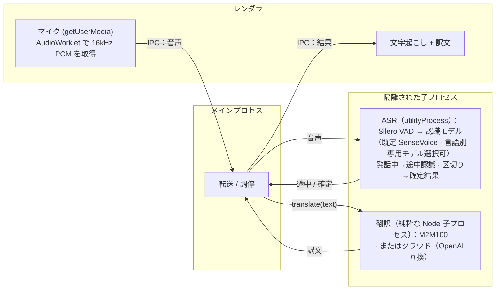

<p align="center">
  
</p>

# Realtime Translator

> macOS・iOS・ブラウザ向けのローカル・リアルタイム音声文字起こし＆翻訳——音声もテキストも端末に留まります（クラウド翻訳は任意）。

[English](README.md) · [简体中文](README.zh-CN.md) · **日本語** · [한국어](README.ko.md)

インストール不要、ブラウザですぐに Web 版を試せます：**https://baijunjie.github.io/realtime-translator/**

## プラットフォーム

3 つのプラットフォームは同じコアロジックと UI を共有し、動作方式と一部の機能だけが異なります：

|  | macOS | iOS | Web |
|---|---|---|---|
| **入手方法** | 未署名の `.dmg`（[Releases](https://github.com/baijunjie/realtime-translator/releases)） | ソースからビルド | [ブラウザで開く](https://baijunjie.github.io/realtime-translator/) / PWA としてインストール |
| **認識モデル** | SenseVoice + Paraformer / ReazonSpeech / Parakeet | SenseVoice | SenseVoice + Paraformer / ReazonSpeech / Parakeet |
| **ローカル翻訳** | M2M-100 418M / 1.2B | Apple 端末上翻訳 | M2M-100 418M † |
| **クラウド翻訳** | ✓ | ✓ | ✓ |
| **音源** | マイク + システム音声（14.2 以降） | マイク | マイク |
| **ランタイム** | Electron · sherpa-onnx N-API | Capacitor · ネイティブ C++ | ブラウザ · 単一スレッド WASM |
| **ストレージ** | アプリデータのファイル | Preferences | IndexedDB + Cache |

† iOS / iPadOS Safari ではローカル翻訳は利用できません（WebKit のタブ単位メモリが ASR と翻訳モデルを同時に収められないため）——これらの端末はクラウド翻訳のみになります。

### macOS

[Releases ページ](https://github.com/baijunjie/realtime-translator/releases) から最新の `.dmg`（Apple Silicon）をダウンロードし、アプリを**アプリケーション**フォルダにドラッグします。

**未署名ビルド**——この beta は署名／公証されていません。初回起動時：

- アプリを右クリック →「**開く**」して確認；または
- 実行：`xattr -dr com.apple.quarantine "/Applications/Realtime Translator.app"`

macOS は最も機能が充実したプラットフォームです：マイクに加えて**システム音声**（Mac が再生中の音、macOS 14.2 以降）を取り込め、さらに高品質な M2M-100 1.2B 翻訳モデルも選べます。

### iOS

事前ビルド済みのアプリはまだありません。ソースからビルドしてください：ネイティブプラグインを Capacitor iOS ホストに組み込む必要があり、Xcode ツールチェーンと実機が必須です（Apple の Translation フレームワークはシミュレータでは動きません）。[`apps/ios/native-plugin/INTEGRATION.md`](apps/ios/native-plugin/INTEGRATION.md) を参照。認識は端末上で実行（SenseVoice）、翻訳は Apple の端末上 Translation フレームワーク（iOS 18+）を使います。

### Web

すべてブラウザ内で動作します——インストール不要、サーバー不要。**[baijunjie.github.io/realtime-translator](https://baijunjie.github.io/realtime-translator/) で直接開く**か、PWA としてインストールできます。初回読み込み後はオフラインで動作します（モデルとアプリシェルをキャッシュ）。マイクのみ対応。

## 機能

- 中国語 / 日本語 / 英語 / 韓国語のリアルタイム音声認識——自動判定、または単一言語に固定して短い発話での誤判定を大きく削減
- ライブ字幕——話している間に途中結果を表示し、発話区切りで確定
- **母語ドリブン**——選んだ言語が UI 言語であると同時に翻訳先；他の言語はすべてそれに翻訳（中国語は簡体字に統一）。自動判定モードでは、母語の発話をセッション内で直近に聞き取った他言語へ逆翻訳します
- **ローカル or クラウド翻訳**——ローカルモデルはオフラインで動作しテキストは端末外に出ません；クラウドは任意の OpenAI 互換エンドポイント（テキストは第三者に送信されます）
- 認識・翻訳モデルはいずれもオンデマンドでダウンロード（アプリに同梱しません）
- 会話のアーカイブ——セッションを保存して後で再表示
- CPU のみでリアルタイム動作（Apple Silicon 実測 RTF ≈ 0.03）、GPU 不要

## 使い方

1. **初回起動**——オンボーディング画面で母語を選択。
2. **録音開始**をクリック——話すと字幕がリアルタイムに表示されます。選んだ認識モデルが未ダウンロードなら、まずダウンロードを確認し、バックグラウンドでダウンロードされ、準備ができたら自動で録音が始まります（本回の録音だけをキャンセルし、ダウンロードは続行させることもできます）。
3. 設定で**翻訳方式**（ローカルモデル / クラウド / オフ）を選ぶと各行の下に母語訳が表示。
4. **⚙ 設定**で母語・認識言語と認識モデル・音源・文字サイズ・テーマ・翻訳方式（およびクラウド認証情報）を変更；「モデルの管理」タブで各モデルの確認・ダウンロード・削除ができます。

マイクやシステム音声へのアクセスを要求する前に、アプリがアプリ内で用途を説明します。その後 OS が許可ダイアログを表示します。以前に拒否した場合は、ワンタップで該当するシステム設定画面を開けます。

## モデル

どのモデルもオンデマンドで `@rt/core` のレジストリから取得します（アプリには同梱しません）。取得元はプラットフォームごとに分かれ、順序付きフォールバックを備えています：**macOS / iOS** は本リポジトリの自己ホスト GitHub Release（`models-v1` 資産）を優先し、失敗時に上流の HuggingFace へ自動フォールバック；**Web** は GitHub Release 資産が CORS ヘッダを返さないため、上流の HuggingFace（オプションのミラー含む）を直接使用します。各ソースは 1 回だけ試され、全ソース失敗時のみ失敗と判定。

| モデル | 用途 | プラットフォーム | サイズ |
|---|---|---|---|
| Silero VAD | 音声区間検出（各認識モデル共通） | 全て | 約 0.6MB |
| SenseVoice (int8) | 多言語認識（既定） | macOS / iOS / Web | 約 230MB |
| Paraformer-zh (int8) | 中国語認識 | macOS / Web | 約 220MB |
| ReazonSpeech-ja | 日本語認識 | macOS / Web | 約 160MB |
| Parakeet-en (int8) | 英語認識 | macOS / Web | 約 630MB |
| M2M100-418M (q8) | 多言語翻訳（既定） | macOS / Web | 約 640MB |
| M2M100-1.2B (q8) | 多言語翻訳（高品質） | macOS | 約 1.5GB |

iOS は翻訳モデルを**ダウンロードせず**、Apple の端末上翻訳を使います。中国語の訳文は簡体字に統一します（M2M100 / Apple とも簡体/繁体の字形を区別しません）。Web では Silero VAD をダウンロードせず、アプリと同一オリジンに同梱しています。

## アーキテクチャ

**pnpm ワークスペース monorepo**：共有ロジック/UI、プラットフォームごとに 1 パッケージ。3 つとも**同じ `@rt/ui`** を描画し、違いは注入される `AppBridge` だけ——UI はこれを通じてプラットフォーム能力（録音・ストレージ・認識・翻訳）に触れます。

- `packages/core`（`@rt/core`）——プラットフォーム非依存の TS：ドメイン型、設定/アーカイブ、翻訳（`Translator` インターフェース + クラウド + 中国語の簡体字正規化）、ASR とローカル翻訳のマルチモデルレジストリ、`AppBridge` 契約。
- `packages/ui`（`@rt/ui`）——共有 Vue 3 UI；注入された `AppBridge` 経由でのみプラットフォームに触れる（`window.api` 直参照なし）。
- `apps/macos`（`@rt/macos`）——Electron アプリ。
- `apps/ios`（`@rt/ios`）——Capacitor アプリ + ネイティブプラグイン。
- `apps/web`（`@rt/web`）——ブラウザ PWA。
- `assets/`——共有ブランド素材（`icon.svg` / `icon.png`）。各アプリがここから自分のアイコン形式を生成。

文字起こしは全プラットフォームで [sherpa-onnx](https://github.com/k2-fsa/sherpa-onnx)（ONNX Runtime）を使い、ランタイムだけがプラットフォームごとに異なります（上の[プラットフォーム](#プラットフォーム)表を参照）。ローカル翻訳は macOS / Web で [Transformers.js](https://github.com/huggingface/transformers.js) の Meta M2M100（MIT）、iOS で Apple の Translation フレームワーク。いずれも `@rt/core` のインターフェースの背後にあり、より強力なローカルモデルやクラウド API への差し替えは実装を 1 つ追加するだけです。

macOS では ASR は独立した Electron `utilityProcess`、翻訳は独立した純粋な Node 子プロセス（`child_process.fork` + `ELECTRON_RUN_AS_NODE`、Chromium のアロケータから外れて 1.5GB 級のモデル推論に対応）で動きます：重い推論が UI をブロックせず、ネイティブクラッシュや過大なメモリ確保もその子プロセスに隔離されます。Web での相当する隔離はタスクごとの Web Worker、iOS ではネイティブプラグインが担います。



*（図は macOS のプロセス構成；iOS と Web は異なり、それぞれネイティブプラグイン / WASM Worker で、Electron プロセスではありません。）*

## 開発

**pnpm** が必要。Vite + Vue 3 + Naive UI、すべて TypeScript（macOS は electron-vite を使用）。

```bash
pnpm install
pnpm dev                    # macOS アプリをホットリロードで起動（→ @rt/macos）
pnpm --filter @rt/web dev   # ブラウザ PWA の開発サーバを起動（→ @rt/web）
```

iOS は [`apps/ios/native-plugin/INTEGRATION.md`](apps/ios/native-plugin/INTEGRATION.md) を参照。その他：`pnpm build`、`pnpm type-check`；パッケージ単位は `pnpm --filter @rt/macos <script>`（例 `clean`、`test-translate`）。

**パッケージング（macOS）**——`pnpm dist` で未署名の arm64 `.dmg` を `apps/macos/release/` に生成（`pnpm dist:dir` は展開済み `.app` のみ、デバッグ用）。未署名ビルドの開き方は [macOS](#macos) の項を参照；一般配布には Apple Developer ID で署名・公証してください。

**Web デプロイ**——GitHub Actions ワークフロー（`.github/workflows/ci.yml` の `deploy-web` job）が `main` への push ごと、かつ品質ゲート（`check`）が全て通った後にのみ GitHub Pages へデプロイします。ASR をあえて単一スレッド WASM にしているのは、COOP/COEP ヘッダを不要にして Pages で無料ホスティングするためです。

**オフライン検証（GUI 不要）**：

```bash
npm run test-pipeline -- test.wav   # 文字起こし、16kHz モノラルが必要
# 変換: afconvert -f WAVE -d LEI16@16000 -c 1 in.wav out.wav
npm run test-translate              # 多方向翻訳（初回はモデルをダウンロード）
```
