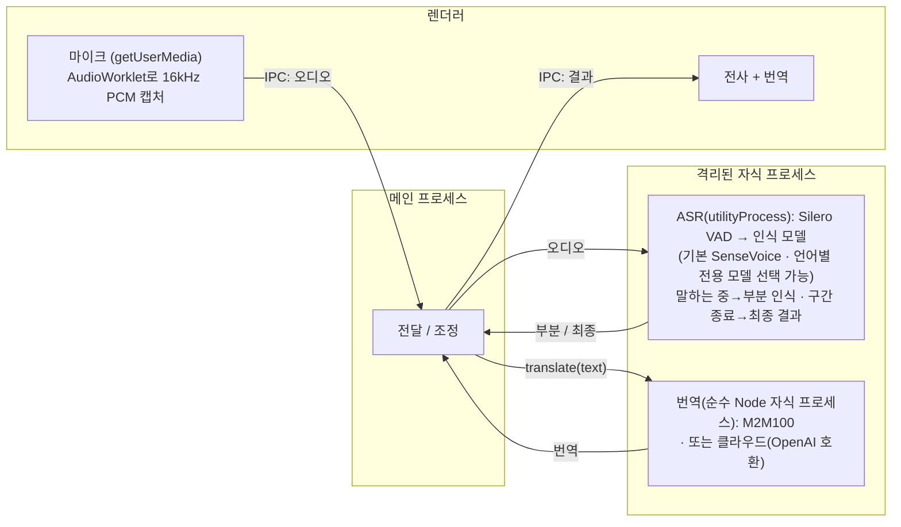

# Realtime Translator

> macOS · iOS · 브라우저용 로컬 실시간 음성 전사 & 번역 — 오디오와 텍스트가 기기에 머뭅니다(클라우드 번역은 선택).

[English](README.md) · [简体中文](README.zh-CN.md) · [日本語](README.ja.md) · **한국어**

지금 브라우저에서 사용해 보기: **https://baijunjie.github.io/realtime-translator/**

## 기능

- 실시간 마이크 전사: 중국어 / 일본어 / 영어 / 한국어(자동 감지, 또는 설정에서 인식 언어 고정 — 고정하면 짧은 발화의 언어 오인식을 크게 줄일 수 있음)
- 인식 모델 선택 가능: SenseVoice(다국어, 전 플랫폼 기본)와 단일 언어 전용 모델 3종 — Paraformer(중국어) · ReazonSpeech(일본어) · Parakeet(영어)(macOS, 웹에서도 실험적으로 사용 가능)
- 실시간 자막 — 말하는 동안 중간 결과 표시, 발화 구간 종료 시 확정
- **모국어 중심** — 첫 실행 시 모국어 선택(중국어, 일본어, 영어, 한국어); 전체 UI가 모국어로 표시되고, 번역을 켜면 다른 언어가 모두 모국어로 번역(중국어 번역문은 간체로 통일)
- 오디오 소스 전환 가능(macOS): 마이크, 또는 시스템 오디오(Mac이 재생 중인 소리를 캡처, macOS 14.2 이상); 웹 / iOS는 마이크만
- 번역 엔진 전환 가능:
  - **로컬**(기본): 기기에서 실행 — 다운로드 후 오프라인 동작, 텍스트가 기기를 벗어나지 않음. macOS는 M2M-100(경량, 약 640MB, 기본) 또는 M2M-100 1.2B(고품질, 약 1.5GB) 선택 가능; 웹은 M2M-100; iOS는 Apple Translation 프레임워크
  - **클라우드**(선택): OpenAI 호환 임의 엔드포인트(설정에서 Base URL / API Key / 모델 입력; 키는 기기에만 저장) — 활성화하면 텍스트가 제3자로 전송됨
- 대화 보관 — 세션을 저장하고 나중에 다시 열기
- 설정: 모국어, 인식 언어와 인식 모델, 오디오 소스, 자막 글자 크기, 테마, 번역 방식; '모델 관리' 탭에서 각 모델 확인 / 다운로드 / 삭제(하단에 빌드 버전 표시)
- 온디맨드 모델 다운로드 — '녹음 시작'을 누를 때(또는 설정에서 아직 다운로드하지 않은 모델을 선택할 때) 확인 대화상자(모델 이름과 크기 표시)가 뜨고, 확인 후 다운로드가 백그라운드에서 실행됩니다(여러 모델이 병렬로 다운로드), UI가 사용 가능한 상태로 유지됩니다. '모델 관리'에서는 다운로드 중인 각 모델에 인라인 진행률 표시줄과 취소(✕) 버튼이 표시됩니다 — 취소하면 중단되고 해당 모델의 부분 다운로드가 삭제됩니다. 이미 다운로드한 모델은 앱 실행 시 미리 로드되어 '녹음 시작'을 누르면 즉시 녹음이 시작됩니다
- CPU만으로 실시간 동작(Apple Silicon 실측 RTF ≈ 0.03), GPU 불필요

## 사용법

1. **첫 실행** — 온보딩 화면에서 모국어를 선택합니다.
2. **녹음 시작**을 클릭 — 선택한 인식 모델이 아직 다운로드되지 않았다면 확인 대화상자(모델 이름과 크기 표시)가 먼저 뜹니다. 확인 후 진행률 대화상자가 표시되고, 모델 준비가 완료되면 자동으로 녹음이 시작됩니다. 해당 대화상자에서 이번 녹음을 취소할 수 있지만, 다운로드는 백그라운드에서 계속됩니다. 말하면 자막이 실시간으로 표시됩니다.
3. 설정에서 **번역 방식**(로컬 모델 / 클라우드 / 끄기)을 선택하면 각 줄 아래에 모국어 번역이 표시됩니다. 로컬 번역 모델을 처음 켤 때도 동일한 다운로드 확인 대화상자(예: M2M-100, 약 640MB)가 먼저 뜹니다.
4. **⚙ 설정**에서 모국어 · 인식 언어와 인식 모델 · 오디오 소스 · 글자 크기 · 테마 · 번역 방식(및 클라우드 자격 증명)을 변경합니다; '모델 관리' 탭에서 각 모델을 확인 · 다운로드 · 삭제할 수 있습니다.

마이크나 시스템 오디오 접근을 요청하기 전에 앱이 먼저 앱 내에서 용도를 설명합니다. 이후 OS가 자체 권한 대화상자를 표시합니다. 이전에 거부한 경우 한 번의 탭으로 해당 시스템 설정 화면을 열 수 있습니다.

## 프로젝트 구조

**pnpm 워크스페이스 monorepo** — 공유 로직/UI, 플랫폼별 1개 패키지. 세 플랫폼 모두 **동일한 `@rt/ui`**를 렌더링하며, 차이는 주입되는 `AppBridge`뿐입니다:

- `packages/core`(`@rt/core`) — 플랫폼 비의존 TS: 도메인 타입, 설정/보관 로직, 번역(`Translator` + 클라우드 + 중국어 간체 정규화), ASR과 로컬 번역의 멀티 모델 레지스트리, 플랫폼 능력 브리지 `AppBridge`.
- `packages/ui`(`@rt/ui`) — 공유 Vue 3 UI; 주입된 `AppBridge`를 통해서만 플랫폼에 접근(`window.api` 직접 참조 없음).
- `apps/macos`(`@rt/macos`) — Electron 앱; `AppBridge`(녹음·fs 저장, ASR은 utilityProcess, 번역은 순수 Node 자식 프로세스)를 구현하고 `@rt/ui`를 호스팅.
- `apps/ios`(`@rt/ios`) — Capacitor 앱(동작 완비); 네이티브 플러그인이 기기에서 sherpa-onnx로 인식(iOS xcframework), 기기 내 번역은 Apple Translation 프레임워크(iOS 18+). `apps/ios/native-plugin/INTEGRATION.md` 참고.
- `apps/web`(`@rt/web`) — 설치 가능한 브라우저 **PWA**; ASR은 단일 스레드 WebAssembly를 Web Worker에서 실행(sherpa-onnx), 로컬 번역은 Transformers.js(M2M100)를 Web Worker에서 실행, 저장은 IndexedDB. 배포 주소 https://baijunjie.github.io/realtime-translator/ .
- `assets/` — 공유 브랜드 소스(`icon.svg` / `icon.png`); 각 앱이 여기서 자체 아이콘 포맷을 생성.

## 개발

**pnpm** 필요. Vite + Vue 3 + Naive UI, 전부 TypeScript(macOS는 electron-vite 사용).

```bash
pnpm install
pnpm dev                    # macOS 앱을 핫 리로드로 실행(→ @rt/macos)
pnpm --filter @rt/web dev   # 브라우저 PWA 개발 서버 실행(→ @rt/web)
```

iOS는 `apps/ios/native-plugin/INTEGRATION.md`를 참고하세요(네이티브 플러그인을 Capacitor iOS 호스트에 연결해야 하며, Xcode 툴체인이 필요하고 Translation 프레임워크는 실기기가 필요).

macOS / 웹에서는 인식 모델과 로컬 번역 모델 모두 온디맨드로 다운로드됩니다: 처음 '녹음 시작'을 누를 때, 또는 설정에서 아직 다운로드하지 않은 모델을 선택할 때 확인 대화상자가 뜬 뒤 다운로드가 진행됩니다. 다운로드는 백그라운드에서 실행됩니다('모델 관리'에 인라인 진행률 표시줄 + 취소).

기타 스크립트: `pnpm build`, `pnpm type-check`. 패키지 단위: `pnpm --filter @rt/macos <script>`(예: `clean`, `test-translate`).

### 패키징(macOS)

```bash
pnpm dist        # 빌드 + electron-builder → apps/macos/release/*.dmg (arm64)
pnpm dist:dir    # 압축 해제된 .app만 (더 빠름, 디버깅용)
```

생성물은 현재 **서명되지 않음** — 열려면 우클릭 → 「열기」(또는 app에 `xattr -dr com.apple.quarantine` 실행). 공개 배포 시 Apple Developer ID로 서명 및 공증하세요. 모델은 동봉되지 않으며 최초 사용 시 사용자 데이터 폴더로 다운로드됩니다.

### 웹(PWA)

배포 주소 **https://baijunjie.github.io/realtime-translator/** — 설치 가능하며, 첫 로드 이후 오프라인으로 동작합니다(모델과 앱 셸을 캐시).

- ASR은 **단일 스레드 WebAssembly**를 Web Worker에서 실행(sherpa-onnx) — COOP/COEP 헤더가 필요 없어 GitHub Pages에서 무료로 호스팅할 수 있습니다.
- 모델은 온디맨드로 가져옵니다: GitHub Release 자산은 CORS 헤더를 보내지 않으므로 브라우저는 인식 모델과 번역 모델을 모두 상류 HuggingFace(선택적 미러 포함)에서 가져오며, Silero VAD는 앱과 동일 출처로 번들된 상태로 유지되고, Cache Storage에 캐시됩니다. 설정/보관은 IndexedDB에 저장됩니다.
- GitHub Actions 워크플로(`.github/workflows/ci.yml`의 `deploy-web` job)가 `main`에 푸시할 때마다, 그리고 품질 게이트(`check`)가 모두 통과한 후에만 배포합니다 — 잘못된 코드는 프로덕션에 나갈 수 없습니다.

```bash
pnpm --filter @rt/web dev      # 개발 서버
pnpm --filter @rt/web build    # 프로덕션 빌드 → apps/web/dist
```

### 오프라인 테스트(GUI 불필요)

```bash
npm run test-pipeline -- test.wav   # 전사, 16kHz 모노 필요
# 변환: afconvert -f WAVE -d LEI16@16000 -c 1 in.wav out.wav

npm run test-translate              # 다방향 번역(최초 실행 시 모델 다운로드)
```

## 모델

인식은 기본으로 SenseVoice(다국어, 전 플랫폼 사용 가능)를 쓰고, 단일 언어 전용인 Paraformer / ReazonSpeech / Parakeet도 선택할 수 있습니다. 로컬 번역은 macOS에서 M2M-100(더 큰 1.2B 버전도 선택 가능), 웹에서 M2M-100, iOS에서 Apple의 기기 내 번역을 사용합니다. 모든 모델은 온디맨드로 `@rt/core` 레지스트리에서 가져오며, 런타임만 다릅니다(macOS는 네이티브 N-API, iOS는 xcframework, 웹은 단일 스레드 WASM).

받는 곳은 플랫폼별로 나뉘며 순서가 있는 폴백을 지원합니다: **macOS / iOS**는 이 저장소의 GitHub Release(자체 호스팅 `models-v1` 자산)를 우선으로 하고, 실패 시 상류 HuggingFace로 자동 폴백되며; **웹**은 GitHub Release 자산이 CORS 헤더를 보내지 않으므로 상류 HuggingFace(선택적 미러 포함)를 주요 소스로 사용합니다(Silero VAD는 웹에서 앱과 동일 출처로 번들된 상태 유지). 각 소스는 한 번만 시도되며, 모든 소스가 실패할 때만 실패 판정됩니다.

| 모델 | 용도 | 플랫폼 | 크기 | 받기 |
|---|---|---|---|---|
| Silero VAD | 음성 구간 감지(모든 인식 모델 공통) | 전체 | 약 0.6MB | macOS / iOS는 GitHub Release; 웹은 앱과 동일 출처로 번들 |
| SenseVoice (int8) | 다국어 인식(기본) | macOS / iOS / 웹 | 약 230MB | macOS / iOS: GitHub Release(+ HuggingFace 폴백); 웹: HuggingFace |
| Paraformer-zh (int8) | 중국어 인식 | macOS / 웹 | 약 220MB | macOS: GitHub Release(+ HuggingFace 폴백); 웹: HuggingFace |
| ReazonSpeech-ja | 일본어 인식 | macOS / 웹 | 약 160MB | macOS: GitHub Release(+ HuggingFace 폴백); 웹: HuggingFace |
| Parakeet-en (int8) | 영어 인식 | macOS / 웹 | 약 630MB | macOS: GitHub Release(+ HuggingFace 폴백); 웹: HuggingFace |
| M2M100-418M (q8) | 다국어 번역(기본) | macOS / 웹 | 약 640MB | macOS: GitHub Release(+ HuggingFace 폴백); 웹: HuggingFace |
| M2M100-1.2B (q8) | 다국어 번역(고품질) | macOS | 약 1.5GB | GitHub Release(직접 변환·자체 호스팅, 상류 미러 없음) |

iOS는 번역 모델을 **다운로드하지 않고** Apple의 기기 내 번역을 사용합니다. 중국어 번역문은 간체로 통일합니다(M2M100 / Apple 모두 간체/번체 자형을 구분하지 않습니다).

## 아키텍처

세 플랫폼은 `@rt/core` + `@rt/ui`를 공유하며 차이는 `AppBridge` 구현뿐입니다. 동일한 ASR 모델이 각 플랫폼의 런타임에서 동작합니다 — **macOS** = sherpa-onnx-node(네이티브 N-API), **iOS** = sherpa-onnx xcframework(네이티브 C++), **웹** = sherpa-onnx 단일 스레드 WASM. 로컬 번역도 플랫폼별로 — **macOS / 웹** = M2M100(Transformers.js, onnxruntime-node / onnxruntime-web; macOS는 1.2B 버전도 선택 가능), **iOS** = Apple Translation 프레임워크. 클라우드(OpenAI 호환 임의 엔드포인트)는 세 플랫폼 모두에서 사용 가능합니다.

아래 그림은 macOS의 프로세스 구성입니다(iOS와 웹은 다르며, 각각 네이티브 플러그인 / WASM Worker로, Electron 프로세스가 아닙니다):



macOS에서는 ASR은 독립된 Electron `utilityProcess`에서, 번역은 독립된 순수 Node 자식 프로세스(`child_process.fork` + `ELECTRON_RUN_AS_NODE`; Chromium 할당자에서 분리해 1.5GB급 모델 추론을 감당)에서 실행됩니다. 무거운 네이티브 추론이 UI를 막지 않고, 네이티브 크래시나 과도한 메모리 할당도 해당 프로세스에만 격리되어 앱 전체를 끌어내리지 않습니다. 웹에서 대응하는 격리는 작업별 Web Worker이고, iOS에서는 네이티브 플러그인이 담당합니다.

전사는 [sherpa-onnx](https://github.com/k2-fsa/sherpa-onnx)(ONNX Runtime), macOS와 웹의 로컬 번역은 [Transformers.js](https://github.com/huggingface/transformers.js)로 Meta M2M100-418M(MIT)을 실행합니다. 번역은 `@rt/core`의 `Translator` 인터페이스 뒤에 있고(모델마다 spec 하나) — 더 강력한 로컬 모델, Apple 프레임워크, 클라우드 API로 교체하려면 구현 하나만 추가하면 됩니다.
