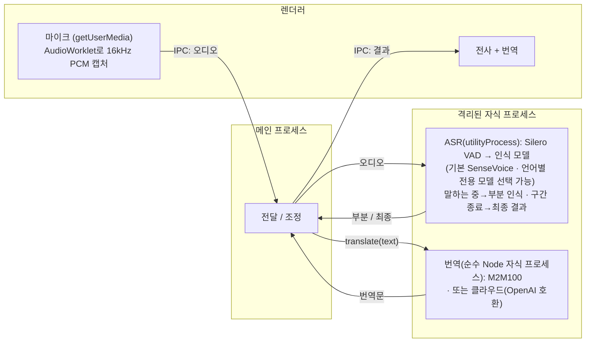

<p align="center">
  
</p>

# Realtime Translator

> macOS · iOS · 브라우저용 로컬 실시간 음성 전사 & 번역 — 오디오와 텍스트가 기기에 머뭅니다(클라우드 번역은 선택).

[English](README.md) · [简体中文](README.zh-CN.md) · [日本語](README.ja.md) · **한국어**

설치 없이 브라우저에서 바로 웹 버전을 사용해 보기: **https://baijunjie.github.io/realtime-translator/**

## 플랫폼

세 플랫폼은 동일한 코어 로직과 UI를 공유하며, 실행 방식과 일부 기능만 다릅니다:

|  | macOS | iOS | 웹 |
|---|---|---|---|
| **받기** | 서명되지 않은 `.dmg`([Releases](https://github.com/baijunjie/realtime-translator/releases)) | 소스에서 빌드 | [브라우저에서 열기](https://baijunjie.github.io/realtime-translator/) / PWA로 설치 |
| **인식 모델** | SenseVoice + Paraformer / ReazonSpeech / Parakeet | SenseVoice | SenseVoice + Paraformer / ReazonSpeech / Parakeet |
| **로컬 번역** | M2M-100 418M / 1.2B | Apple 기기 내 번역 | M2M-100 418M † |
| **클라우드 번역** | ✓ | ✓ | ✓ |
| **오디오 소스** | 마이크 + 시스템 오디오(14.2 이상) | 마이크 | 마이크 |
| **런타임** | Electron · sherpa-onnx N-API | Capacitor · 네이티브 C++ | 브라우저 · 단일 스레드 WASM |
| **저장** | 앱 데이터 파일 | Preferences | IndexedDB + Cache |

† iOS / iPadOS Safari에서는 로컬 번역을 사용할 수 없습니다(WebKit의 탭 단위 메모리가 ASR와 번역 모델을 함께 담지 못하므로) — 해당 기기는 클라우드 번역만 제공합니다.

### macOS

[Releases 페이지](https://github.com/baijunjie/realtime-translator/releases)에서 최신 `.dmg`(Apple Silicon)를 내려받아 앱을 **응용 프로그램** 폴더로 드래그합니다.

**서명되지 않은 빌드** — 이 beta는 서명/공증되지 않았습니다. 처음 열 때:

- 앱을 우클릭 → **열기** 후 확인; 또는
- 실행: `xattr -dr com.apple.quarantine "/Applications/Realtime Translator.app"`

macOS는 가장 기능이 풍부한 플랫폼입니다: 마이크에 더해 **시스템 오디오**(Mac이 재생 중인 소리, macOS 14.2 이상)를 캡처할 수 있고, 더 높은 품질의 M2M-100 1.2B 번역 모델도 제공합니다.

### iOS

아직 사전 빌드된 앱이 없어 소스에서 직접 빌드해야 합니다: 네이티브 플러그인을 Capacitor iOS 호스트에 연결해야 하며, Xcode 툴체인과 실기기가 필요합니다(Apple의 Translation 프레임워크는 시뮬레이터에서 동작하지 않음). [`apps/ios/native-plugin/INTEGRATION.md`](apps/ios/native-plugin/INTEGRATION.md) 참고. 인식은 기기에서 실행(SenseVoice), 번역은 Apple의 기기 내 Translation 프레임워크(iOS 18+)를 사용합니다.

### 웹

모든 것이 브라우저 안에서 동작합니다 — 설치 불필요, 서버 불필요. **[baijunjie.github.io/realtime-translator](https://baijunjie.github.io/realtime-translator/)에서 바로 열거나** PWA로 설치하세요; 첫 로드 이후 오프라인으로 동작합니다(모델과 앱 셸을 캐시). 마이크만 지원.

## 기능

- 중국어 / 일본어 / 영어 / 한국어 실시간 음성 인식 — 자동 감지, 또는 단일 언어로 고정하여 짧은 발화의 오인식을 크게 감소
- 실시간 자막 — 말하는 동안 중간 결과 표시, 발화 구간 종료 시 확정
- **모국어 중심** — 선택한 언어가 UI 언어이자 번역 대상; 다른 언어는 모두 그 언어로 번역(중국어는 간체로 통일). 자동 감지 모드에서는 모국어 발화를 이번 세션에서 가장 최근에 들은 다른 언어로 역번역합니다
- **로컬 또는 클라우드 번역** — 로컬 모델은 오프라인으로 동작하며 텍스트가 기기를 벗어나지 않음; 클라우드는 선택적 OpenAI 호환 엔드포인트(텍스트가 제3자로 전송됨)
- 인식·번역 모델 모두 온디맨드로 다운로드(앱에 동봉하지 않음)
- 대화 보관 — 세션을 저장하고 나중에 다시 열기
- CPU만으로 실시간 동작(Apple Silicon 실측 RTF ≈ 0.03), GPU 불필요

## 사용법

1. **첫 실행** — 온보딩 화면에서 모국어를 선택합니다.
2. **녹음 시작**을 클릭 — 말하면 자막이 실시간으로 표시됩니다. 선택한 인식 모델이 아직 다운로드되지 않았다면 먼저 다운로드를 확인하고, 백그라운드에서 다운로드된 뒤 모델 준비가 완료되면 자동으로 녹음이 시작됩니다(이번 녹음만 취소하고 다운로드는 계속 진행할 수 있습니다).
3. 설정에서 **번역 방식**(로컬 모델 / 클라우드 / 끄기)을 선택하면 각 줄 아래에 모국어 번역이 표시됩니다.
4. **⚙ 설정**에서 모국어 · 인식 언어와 인식 모델 · 오디오 소스 · 글자 크기 · 테마 · 번역 방식(및 클라우드 자격 증명)을 변경합니다; '모델 관리' 탭에서 각 모델을 확인 · 다운로드 · 삭제할 수 있습니다.

마이크나 시스템 오디오 접근을 요청하기 전에 앱이 먼저 앱 내에서 용도를 설명합니다. 이후 OS가 자체 권한 대화상자를 표시합니다. 이전에 거부한 경우 한 번의 탭으로 해당 시스템 설정 화면을 열 수 있습니다.

## 모델

모든 모델은 온디맨드로 `@rt/core` 레지스트리에서 가져옵니다(앱에 동봉하지 않음). 받는 곳은 플랫폼별로 나뉘며 순서가 있는 폴백을 지원합니다: **macOS / iOS**는 이 저장소의 자체 호스팅 GitHub Release(`models-v1` 자산)를 우선으로 하고 실패 시 상류 HuggingFace로 자동 폴백하며; **웹**은 GitHub Release 자산이 CORS 헤더를 보내지 않으므로 상류 HuggingFace(선택적 미러 포함)를 직접 사용합니다. 각 소스는 한 번만 시도되며, 모든 소스가 실패할 때만 실패로 판정됩니다.

| 모델 | 용도 | 플랫폼 | 크기 |
|---|---|---|---|
| Silero VAD | 음성 구간 감지(모든 인식 모델 공통) | 전체 | 약 0.6MB |
| SenseVoice (int8) | 다국어 인식(기본) | macOS / iOS / 웹 | 약 230MB |
| Paraformer-zh (int8) | 중국어 인식 | macOS / 웹 | 약 220MB |
| ReazonSpeech-ja | 일본어 인식 | macOS / 웹 | 약 160MB |
| Parakeet-en (int8) | 영어 인식 | macOS / 웹 | 약 630MB |
| M2M100-418M (q8) | 다국어 번역(기본) | macOS / 웹 | 약 640MB |
| M2M100-1.2B (q8) | 다국어 번역(고품질) | macOS | 약 1.5GB |

iOS는 번역 모델을 **다운로드하지 않고** Apple의 기기 내 번역을 사용합니다. 중국어 번역문은 간체로 통일합니다(M2M100 / Apple 모두 간체/번체 자형을 구분하지 않습니다). 웹에서는 Silero VAD를 다운로드하지 않고 앱과 동일 출처로 번들합니다.

## 아키텍처

**pnpm 워크스페이스 monorepo**: 공유 로직/UI, 플랫폼별 1개 패키지. 세 플랫폼 모두 **동일한 `@rt/ui`**를 렌더링하며, 차이는 주입되는 `AppBridge`뿐입니다 — UI는 이를 통해 플랫폼 능력(녹음·저장·인식·번역)에 접근합니다.

- `packages/core`(`@rt/core`) — 플랫폼 비의존 TS: 도메인 타입, 설정/보관 로직, 번역(`Translator` 인터페이스 + 클라우드 + 중국어 간체 정규화), ASR과 로컬 번역의 멀티 모델 레지스트리, `AppBridge` 계약.
- `packages/ui`(`@rt/ui`) — 공유 Vue 3 UI; 주입된 `AppBridge`를 통해서만 플랫폼에 접근(`window.api` 직접 참조 없음).
- `apps/macos`(`@rt/macos`) — Electron 앱.
- `apps/ios`(`@rt/ios`) — Capacitor 앱 + 네이티브 플러그인.
- `apps/web`(`@rt/web`) — 브라우저 PWA.
- `assets/` — 공유 브랜드 소스(`icon.svg` / `icon.png`); 각 앱이 여기서 자체 아이콘 포맷을 생성.

전사는 모든 플랫폼에서 [sherpa-onnx](https://github.com/k2-fsa/sherpa-onnx)(ONNX Runtime)를 사용하며, 런타임만 플랫폼별로 다릅니다(위 [플랫폼](#플랫폼) 표 참고). 로컬 번역은 macOS / 웹에서 [Transformers.js](https://github.com/huggingface/transformers.js)로 Meta M2M100(MIT)을, iOS에서 Apple의 Translation 프레임워크를 실행합니다. 둘 다 `@rt/core`의 인터페이스 뒤에 있어, 더 강력한 로컬 모델이나 클라우드 API로 교체하는 것은 구현 하나를 추가하는 일입니다.

macOS에서 ASR은 자체 Electron `utilityProcess`, 번역은 자체 순수 Node 자식 프로세스(`child_process.fork` + `ELECTRON_RUN_AS_NODE`, Chromium 할당자에서 벗어나 1.5GB급 추론을 처리)에서 실행됩니다: 무거운 네이티브 작업이 UI를 막지 않고, 네이티브 크래시나 과도한 메모리 할당도 해당 프로세스에 격리됩니다. 웹에서 이에 해당하는 격리는 작업별 Web Worker이고, iOS에서는 네이티브 플러그인이 담당합니다.



*(그림은 macOS의 프로세스 구성; iOS와 웹은 다르며 각각 네이티브 플러그인 / WASM Worker로, Electron 프로세스가 아닙니다.)*

## 개발

**pnpm** 필요. Vite + Vue 3 + Naive UI, 전부 TypeScript(macOS는 electron-vite 사용).

```bash
pnpm install
pnpm dev                    # macOS 앱을 핫 리로드로 실행(→ @rt/macos)
pnpm --filter @rt/web dev   # 브라우저 PWA 개발 서버 실행(→ @rt/web)
```

iOS는 [`apps/ios/native-plugin/INTEGRATION.md`](apps/ios/native-plugin/INTEGRATION.md)를 참고하세요. 기타 스크립트: `pnpm build`, `pnpm type-check`; 패키지 단위는 `pnpm --filter @rt/macos <script>`(예: `clean`, `test-translate`).

**패키징(macOS)** — `pnpm dist`는 서명되지 않은 arm64 `.dmg`를 `apps/macos/release/`에 빌드합니다(`pnpm dist:dir`는 압축 해제된 `.app`만, 디버깅용). 서명되지 않은 빌드를 여는 방법은 [macOS](#macos) 항을 참고; 공개 배포 시 Apple Developer ID로 서명 및 공증하세요.

**웹 배포** — GitHub Actions 워크플로(`.github/workflows/ci.yml`의 `deploy-web` job)가 `main`에 푸시할 때마다, 그리고 품질 게이트(`check`)가 모두 통과한 후에만 GitHub Pages에 배포합니다. ASR을 단일 스레드 WASM으로 만든 이유는 COOP/COEP 헤더 없이 Pages에서 무료로 호스팅하기 위해서입니다.

**오프라인 테스트(GUI 불필요)**:

```bash
npm run test-pipeline -- test.wav   # 전사, 16kHz 모노 필요
# 변환: afconvert -f WAVE -d LEI16@16000 -c 1 in.wav out.wav
npm run test-translate              # 다방향 번역(최초 실행 시 모델 다운로드)
```
