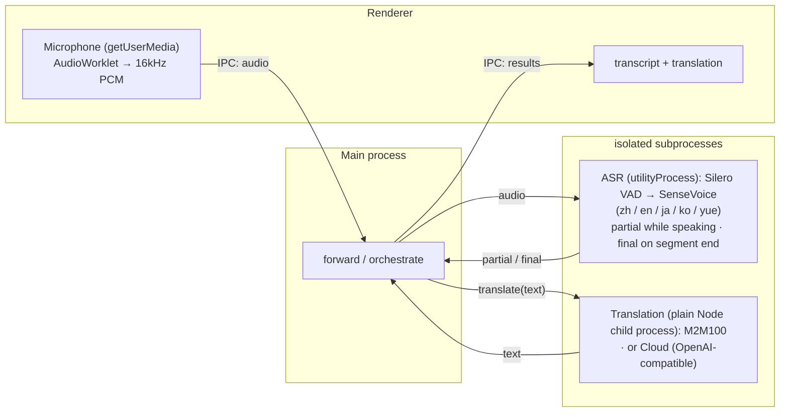

# Realtime Translator

> Local, real-time speech transcription & translation for macOS, iOS, and the browser — audio and text stay on-device (cloud translation optional).

**English** · [简体中文](README.zh-CN.md) · [日本語](README.ja.md) · [한국어](README.ko.md)

Try it now in your browser: **https://baijunjie.github.io/realtime-translator/**

## Features

- Real-time microphone transcription: Chinese / Japanese / English / Korean (auto-detected, or lock the recognition language in Settings — locking it markedly cuts language misdetection on short utterances)
- Choice of recognition model: SenseVoice (multilingual, the default everywhere) plus three single-language models — Paraformer (Chinese), ReazonSpeech (Japanese), and Parakeet (English) — on macOS (also usable experimentally on web)
- Live captions — partial results appear while you speak, finalized when the segment ends
- **Native-language driven** — pick your language on first launch (Chinese, Japanese, English, Korean); the whole UI is shown in it, and when translation is on, everything spoken in other languages is translated into it (Chinese output is normalized to Simplified)
- Switchable audio source (macOS): microphone, or system audio (capture what your Mac is playing, macOS 14.2+); web / iOS are microphone-only
- Switchable translation engine:
  - **Local** (default): on-device translation — downloaded once, then works offline; text never leaves your machine. macOS offers M2M-100 (lightweight, ~640 MB, default) or M2M-100 1.2B (higher quality, ~1.5 GB); web runs M2M-100; iOS uses Apple's Translation framework
  - **Cloud** (optional): any OpenAI-compatible endpoint (set Base URL / API Key / Model in Settings; the key is stored only on your device) — enabling it means text is sent to a third party
- Archive conversations — save a session and reopen it later
- Settings: native language, recognition language & model, audio source, transcript font size, theme, translation method; a "Manage models" tab lists / downloads / deletes each model (the build version is shown at the bottom)
- On-demand model downloads — hitting Start (or selecting a not-yet-downloaded model in Settings) pops a confirmation listing the model names and sizes; after you confirm it downloads behind a single byte-progress bar and continues automatically once done. Already-downloaded models preload when the app opens, so hitting Start begins recording instantly
- Runs in real time on CPU (RTF ≈ 0.03 on Apple Silicon), no GPU required

## Usage

1. **First launch** — choose your native language on the onboarding screen.
2. Click **Start Recording** — if the selected recognition model isn't downloaded yet, a confirmation appears first (listing the model names and sizes); once you confirm and it finishes, recording starts automatically and captions appear live as you speak.
3. Pick a **translation method** in Settings (local model / cloud / off) — a translation into your language appears under each line. Enabling a local translation model shows the same download confirmation first (e.g. M2M-100, ~640 MB).
4. Open **Settings** (⚙) to change language, recognition language & model, audio source, font size, theme, or translation method (and cloud credentials); a "Manage models" tab lets you view, download, or delete each model.

Before requesting the microphone or system audio, the app first explains in-app what it's used for; the OS then shows its own permission prompt. If you previously denied it, one tap opens the matching system settings page.

## Project structure

A **pnpm-workspace monorepo** — shared logic/UI, one package per platform. All three platforms render the **same `@rt/ui`** and differ only in the injected `AppBridge`:

- `packages/core` (`@rt/core`) — platform-agnostic TypeScript: domain types, settings/archive logic, translation (`Translator` + cloud + Chinese Simplified normalization), the multi-model registry for ASR and local translation, and the platform-capability bridge interface (`AppBridge`).
- `packages/ui` (`@rt/ui`) — shared Vue 3 UI; reaches the platform only through an injected `AppBridge` (no `window.api`).
- `apps/macos` (`@rt/macos`) — the Electron app; implements `AppBridge` (audio capture, fs storage, ASR in a utilityProcess worker, translation in a plain Node child process) and hosts `@rt/ui`.
- `apps/ios` (`@rt/ios`) — a Capacitor app, fully functional: a native plugin runs sherpa-onnx on device for ASR (via the iOS xcframework), and on-device translation uses Apple's Translation framework (iOS 18+). See `apps/ios/native-plugin/INTEGRATION.md`.
- `apps/web` (`@rt/web`) — an installable browser **PWA**; runs sherpa-onnx as single-threaded WebAssembly in a Web Worker for ASR, and M2M100 via Transformers.js in a Web Worker for local translation. Storage via IndexedDB. Live at https://baijunjie.github.io/realtime-translator/.
- `assets/` — shared brand source (`icon.svg` / `icon.png`); each app generates its own icon format from it.

## Development

Requires **pnpm**. Vite + Vue 3 + Naive UI, all TypeScript (macOS uses electron-vite).

```bash
pnpm install
pnpm dev                    # run the macOS app with hot reload (→ @rt/macos)
pnpm --filter @rt/web dev   # run the browser PWA dev server (→ @rt/web)
```

For iOS, see `apps/ios/native-plugin/INTEGRATION.md` (the native plugin must be wired into a Capacitor iOS host; it needs the Xcode toolchain and a real device for the Translation framework).

On macOS/web, recognition and local translation models both download on demand: the first time you hit Start Recording — or select a not-yet-downloaded model in Settings — a confirmation appears, then the download runs.

Other scripts: `pnpm build`, `pnpm type-check`. Per-package: `pnpm --filter @rt/macos <script>` (e.g. `clean`, `test-translate`).

### Packaging (macOS)

```bash
pnpm dist        # build + electron-builder → apps/macos/release/*.dmg (arm64)
pnpm dist:dir    # unpacked .app only (faster, for debugging)
```

The packaged app is currently **unsigned** — to open it, right-click → Open (or run `xattr -dr com.apple.quarantine` on the app). For public distribution, sign & notarize with an Apple Developer ID. Models are not bundled; they download to the user's app-data folder on first use.

### Web (PWA)

Live at **https://baijunjie.github.io/realtime-translator/** — installable, and works offline after the first load (models and app shell are cached).

- ASR runs sherpa-onnx as **single-threaded WebAssembly** in a Web Worker — no COOP/COEP headers needed, so it can be hosted for free on GitHub Pages.
- Models are fetched from an upstream CDN on first use: because GitHub Release assets send no CORS headers, the browser pulls recognition and translation models from upstream HuggingFace (Silero VAD is still bundled same-origin), then caches them in Cache Storage; settings/archives live in IndexedDB.
- Deployed by a GitHub Actions workflow (`.github/workflows/ci.yml`, the `deploy-web` job) on every push to `main`, but only after the quality gate (`check`) passes — bad code can't reach production.

```bash
pnpm --filter @rt/web dev      # dev server
pnpm --filter @rt/web build    # production build → apps/web/dist
```

### Offline testing (no GUI)

```bash
npm run test-pipeline -- test.wav   # transcription, needs 16kHz mono
# convert: afconvert -f WAVE -d LEI16@16000 -c 1 in.wav out.wav

npm run test-translate              # multi-direction translation (downloads model on first run)
```

## Models

Recognition defaults to SenseVoice (multilingual, available everywhere), with three single-language models — Paraformer / ReazonSpeech / Parakeet — as alternatives; local translation runs M2M-100 on macOS (a larger 1.2B variant is also selectable), M2M-100 on web, and Apple's on-device translation on iOS. Every model is fetched on demand from the `@rt/core` registry; only the runtime differs (native N-API on macOS, the iOS xcframework, single-threaded WASM on web).

Download source is per-platform: **macOS / iOS** pull every model from this repo's GitHub Release (the self-hosted `models-v1` assets); **web** pulls from upstream HuggingFace instead, because GitHub Release assets send no CORS headers (Silero VAD stays bundled same-origin on web).

| Model | Purpose | Platforms | Size | How |
|---|---|---|---|---|
| Silero VAD | voice-activity detection (shared by every recognition model) | all | ~0.6MB | GitHub Release on macOS / iOS; bundled same-origin on web |
| SenseVoice (int8) | multilingual recognition (default) | macOS / iOS / web | ~230MB | GitHub Release on macOS / iOS; HuggingFace on web |
| Paraformer-zh (int8) | Chinese recognition | macOS / web | ~220MB | per-platform, as above |
| ReazonSpeech-ja | Japanese recognition | macOS / web | ~160MB | as above |
| Parakeet-en (int8) | English recognition | macOS / web | ~630MB | as above |
| M2M100-418M (q8) | multilingual translation (default) | macOS / web | ~640MB | as above |
| M2M100-1.2B (q8) | multilingual translation (higher quality) | macOS | ~1.5GB | GitHub Release (self-converted and self-hosted; no upstream mirror) |

iOS does **not** download a translation model — it uses Apple's on-device translation instead. Chinese output is normalized to Simplified (neither M2M100 nor Apple distinguishes Simplified/Traditional scripts).

## Architecture

All three platforms share `@rt/core` + `@rt/ui` and differ only in the `AppBridge` implementation. The same ASR models run everywhere, on a per-platform runtime — **macOS** = sherpa-onnx-node (native N-API), **iOS** = sherpa-onnx xcframework (native C++), **web** = sherpa-onnx single-threaded WASM. Local translation is also per-platform — **macOS / web** = M2M100 via Transformers.js (onnxruntime-node / onnxruntime-web; macOS can also opt into the 1.2B variant), **iOS** = Apple's Translation framework. Cloud (any OpenAI-compatible endpoint) is available on all three.

The macOS process layout (iOS and web differ — native plugin / WASM workers respectively, not Electron processes):



On macOS, ASR runs in its own Electron `utilityProcess`, while translation runs in its own plain Node child process (`child_process.fork` + `ELECTRON_RUN_AS_NODE`, off the Chromium allocator so it can handle 1.5 GB-class model inference) — so heavy native inference never blocks the UI, and a native crash (or oversized allocation) is isolated to that process instead of taking down the app. On web the equivalent isolation is a Web Worker per task; on iOS the work happens in the native plugin.

Transcription uses [sherpa-onnx](https://github.com/k2-fsa/sherpa-onnx) (ONNX Runtime); local translation uses [Transformers.js](https://github.com/huggingface/transformers.js) running Meta M2M100-418M (MIT) on macOS and web. Translation sits behind the `Translator` interface in `@rt/core` (one spec per model) — swapping in another local model, Apple's framework, or a cloud API is just another implementation.
