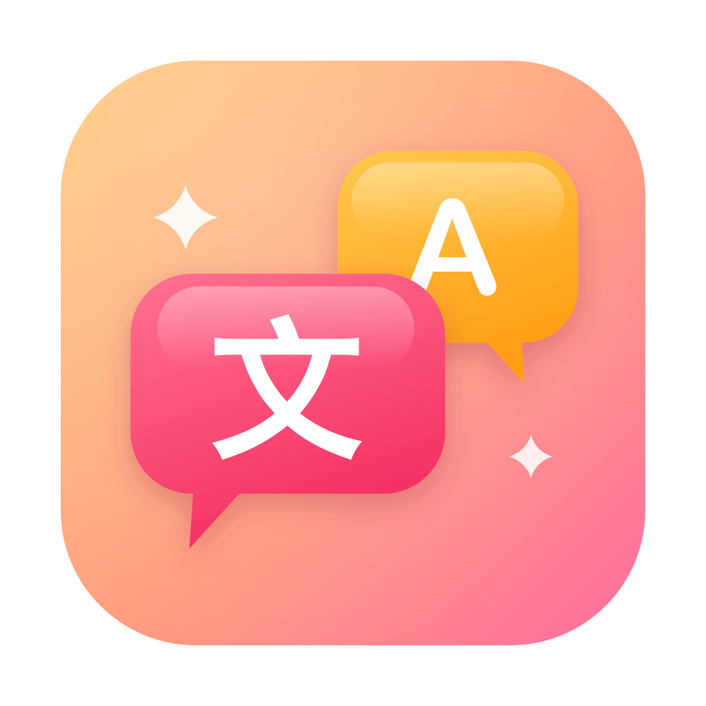
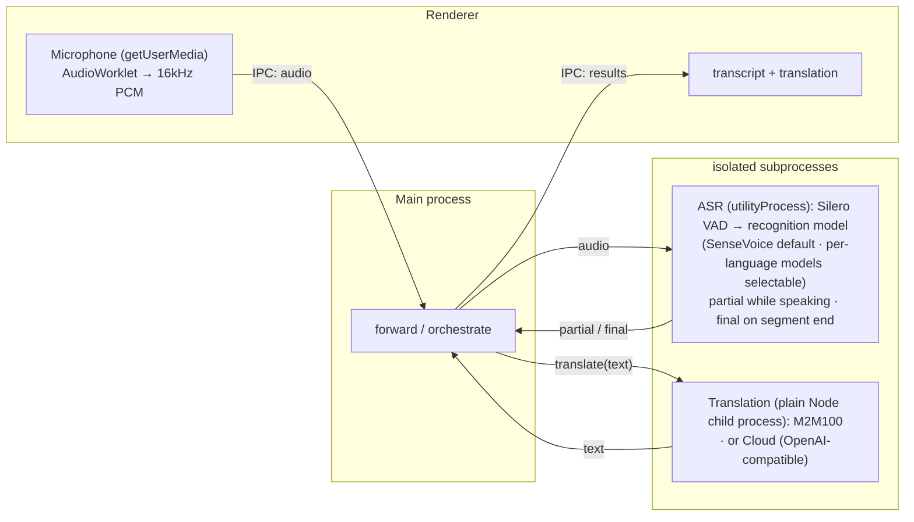

<p align="center">
  
</p>

# Realtime Translator

> Local, real-time speech transcription & translation for macOS, iOS, and the browser — audio and text stay on-device (cloud translation optional).

**English** · [简体中文](README.zh-CN.md) · [日本語](README.ja.md) · [한국어](README.ko.md)

Try the web version instantly, no install: **https://baijunjie.github.io/realtime-translator/**

## Platforms

All three platforms share the same core logic and UI; they differ in how they run and in a few capabilities:

|  | macOS | iOS | Web |
|---|---|---|---|
| **Get it** | Unsigned `.dmg` ([Releases](https://github.com/baijunjie/realtime-translator/releases)) | Build from source | [Open in browser](https://baijunjie.github.io/realtime-translator/) / install as PWA |
| **Recognition models** | SenseVoice + Paraformer / ReazonSpeech / Parakeet | SenseVoice | SenseVoice + Paraformer / ReazonSpeech / Parakeet |
| **Local translation** | M2M-100 418M / 1.2B | Apple on-device | M2M-100 418M † |
| **Cloud translation** | ✓ | ✓ | ✓ |
| **Audio source** | Microphone + system audio (14.2+) | Microphone | Microphone |
| **Runtime** | Electron · sherpa-onnx N-API | Capacitor · native C++ | Browser · single-thread WASM |
| **Storage** | app-data files | Preferences | IndexedDB + Cache |

† On iOS/iPadOS Safari, local translation is unavailable (WebKit's per-tab memory can't hold a translation model alongside ASR) — those devices use cloud translation only.

### macOS

Download the latest `.dmg` (Apple Silicon) from the [Releases page](https://github.com/baijunjie/realtime-translator/releases) and drag the app into **Applications**.

**Unsigned build** — this beta is not signed/notarized. On first open:

- Right-click the app → **Open**, then confirm; or
- Run: `xattr -dr com.apple.quarantine "/Applications/Realtime Translator.app"`

macOS is the most capable target: it can capture **system audio** (what your Mac is playing, macOS 14.2+) as well as the microphone, and it offers the higher-quality M2M-100 1.2B translation model.

### iOS

There is no prebuilt app yet — build it from source. The native plugin must be wired into a Capacitor iOS host, which needs the Xcode toolchain and a real device (Apple's Translation framework doesn't run in the simulator). See [`apps/ios/native-plugin/INTEGRATION.md`](apps/ios/native-plugin/INTEGRATION.md). Recognition runs on-device (SenseVoice); translation uses Apple's on-device Translation framework (iOS 18+).

### Web

Runs entirely in the browser — nothing to install and no server. **Open it at [baijunjie.github.io/realtime-translator](https://baijunjie.github.io/realtime-translator/)** or install it as a PWA; after the first load it works offline (models and app shell are cached). Microphone only.

## Features

- Real-time speech recognition in Chinese / Japanese / English / Korean — auto-detected, or locked to a single language for markedly fewer misdetections on short utterances
- Live captions — partial text while you speak, finalized per segment
- **Native-language driven** — one chosen language is both the interface language and the translation target; speech in any other language is translated into it (Chinese normalized to Simplified). In auto-detect mode, speech in your own language is reverse-translated into the most recent other language
- **On-device or cloud translation** — local models run offline and text never leaves your machine; cloud is an optional OpenAI-compatible endpoint (text is sent to a third party)
- Multiple recognition and translation models, downloaded on demand (nothing is bundled into the app)
- Conversation archive — save a session and reopen it later
- Runs in real time on CPU (RTF ≈ 0.03 on Apple Silicon), no GPU required

## Usage

1. **First launch** — choose your native language on the onboarding screen.
2. Click **Start Recording** — captions appear as you speak. If the selected recognition model isn't downloaded yet, you confirm the download first; it runs in the background and recording starts automatically once the model is ready (you can cancel just the recording and let the download continue).
3. Pick a **translation method** in Settings (local model / cloud / off) — a translation into your language appears under each line.
4. Open **⚙ Settings** to change native language, recognition language & model, audio source, font size, theme, or translation method (and cloud credentials); the "Manage models" tab lists, downloads, or deletes each model.

Before using the microphone or system audio, the app first explains in-app what it's for; the OS then shows its own permission prompt. If you previously denied it, one tap opens the matching system settings page.

## Models

Every model is fetched on demand from the `@rt/core` registry (nothing is bundled into the app). Download source is per-platform with ordered fallback: **macOS / iOS** prefer this repo's self-hosted GitHub Release (the `models-v1` assets) and fall back to upstream HuggingFace on failure; **web** uses upstream HuggingFace directly (optionally mirrored), because GitHub Release assets send no CORS headers. Each source is tried once, and a download fails only when all sources are exhausted.

| Model | Purpose | Platforms | Size |
|---|---|---|---|
| Silero VAD | voice-activity detection (shared by every recognition model) | all | ~0.6MB |
| SenseVoice (int8) | multilingual recognition (default) | macOS / iOS / web | ~230MB |
| Paraformer-zh (int8) | Chinese recognition | macOS / web | ~220MB |
| ReazonSpeech-ja | Japanese recognition | macOS / web | ~160MB |
| Parakeet-en (int8) | English recognition | macOS / web | ~630MB |
| M2M100-418M (q8) | multilingual translation (default) | macOS / web | ~640MB |
| M2M100-1.2B (q8) | multilingual translation (higher quality) | macOS | ~1.5GB |

iOS downloads no translation model — it uses Apple's on-device translation. Chinese output is normalized to Simplified (neither M2M100 nor Apple distinguishes Simplified/Traditional scripts). On web, Silero VAD is bundled same-origin instead of downloaded.

## Architecture

A **pnpm-workspace monorepo**: shared logic and UI, one package per platform. All three render the **same `@rt/ui`** and differ only in the injected `AppBridge` — the interface through which the UI reaches platform capabilities (audio, storage, ASR, translation).

- `packages/core` (`@rt/core`) — platform-agnostic TypeScript: domain types, settings/archive logic, translation (`Translator` interface + cloud + Chinese Simplified normalization), the multi-model registry for ASR and local translation, and the `AppBridge` contract.
- `packages/ui` (`@rt/ui`) — shared Vue 3 UI; reaches the platform only through the injected `AppBridge` (no `window.api`).
- `apps/macos` (`@rt/macos`) — the Electron app.
- `apps/ios` (`@rt/ios`) — the Capacitor app + native plugin.
- `apps/web` (`@rt/web`) — the browser PWA.
- `assets/` — shared brand source (`icon.svg` / `icon.png`); each app generates its own icon format from it.

Transcription uses [sherpa-onnx](https://github.com/k2-fsa/sherpa-onnx) (ONNX Runtime) on every platform, via a per-platform runtime (see the [Platforms](#platforms) table). Local translation uses [Transformers.js](https://github.com/huggingface/transformers.js) running Meta M2M100 (MIT) on macOS and web, and Apple's Translation framework on iOS. Both sit behind interfaces in `@rt/core`, so swapping in another model or a cloud API is just another implementation.

On macOS, ASR runs in its own Electron `utilityProcess`, while translation runs in a plain Node child process (`child_process.fork` + `ELECTRON_RUN_AS_NODE`, off the Chromium allocator so it can handle 1.5 GB-class inference). Heavy native work never blocks the UI, and a native crash or oversized allocation is isolated to that process. On web the equivalent isolation is a Web Worker per task; on iOS the work happens in the native plugin.



*(macOS process layout; iOS and web use a native plugin / WASM workers instead of Electron processes.)*

## Development

Requires **pnpm**. Vite + Vue 3 + Naive UI, all TypeScript (macOS uses electron-vite).

```bash
pnpm install
pnpm dev                    # run the macOS app with hot reload (→ @rt/macos)
pnpm --filter @rt/web dev   # run the browser PWA dev server (→ @rt/web)
```

For iOS, see [`apps/ios/native-plugin/INTEGRATION.md`](apps/ios/native-plugin/INTEGRATION.md). Other scripts: `pnpm build`, `pnpm type-check`; per-package `pnpm --filter @rt/macos <script>` (e.g. `clean`, `test-translate`).

**Packaging (macOS)** — `pnpm dist` builds an unsigned arm64 `.dmg` into `apps/macos/release/` (`pnpm dist:dir` produces an unpacked `.app` for debugging). See [macOS](#macos) for opening an unsigned build; for public distribution, sign & notarize with an Apple Developer ID.

**Web deploy** — a GitHub Actions workflow (`.github/workflows/ci.yml`, the `deploy-web` job) deploys to GitHub Pages on every push to `main`, but only after the quality gate (`check`) passes. ASR runs as single-threaded WASM specifically so no COOP/COEP headers are needed and it can be hosted free on Pages.

**Offline testing (no GUI)**:

```bash
npm run test-pipeline -- test.wav   # transcription, needs 16kHz mono
# convert: afconvert -f WAVE -d LEI16@16000 -c 1 in.wav out.wav
npm run test-translate              # multi-direction translation (downloads model on first run)
```
