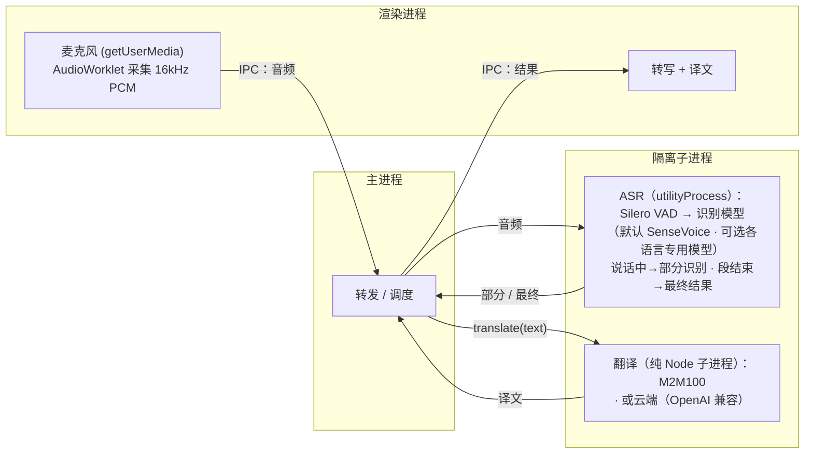

<p align="center">
  
</p>

# Realtime Translator

> 本地实时语音转写与翻译，支持 macOS、iOS 与浏览器——音频和文本都留在本机（云端翻译为可选项）。

[English](README.md) · **简体中文** · [日本語](README.ja.md) · [한국어](README.ko.md)

立即在浏览器里试用：**https://baijunjie.github.io/realtime-translator/**

## 功能

- 实时麦克风转写：中文 / 日语 / 英语 / 韩语（可自动检测，或在设置中锁定识别语言——锁定后能显著减少短句的语种误判）
- 可选识别模型：SenseVoice（多语言，全平台默认），以及 Paraformer（中文）、ReazonSpeech（日语）、Parakeet（英语）三个单语专用模型（macOS，网页亦可实验性启用）
- 实时字幕——说话过程中即显示部分结果，语音段结束后定稿
- **母语驱动**——首次启动选择母语（中文 / 日语 / 英语 / 韩语）；整个界面用母语呈现，开启翻译后其他语言统一翻成母语（中文译文统一归一化为简体）
- 音频来源可切换（macOS）：麦克风，或系统音频（采集 Mac 正在播放的声音，需 macOS 14.2+）；网页 / iOS 仅麦克风
- 翻译引擎可切换：
  - **本地**（默认）：在本机运行——下载后离线可用，文本不出机器。macOS 可选 M2M-100（轻量，约 640MB，默认）或 M2M-100 1.2B（更高质量，约 1.5GB）；网页仅 M2M-100；iOS 用 Apple 的 Translation 框架
  - **云端**（可选）：任意 OpenAI 兼容端点（在设置里填 Base URL / API Key / 模型，密钥仅存本机）——启用即表示文本会发往第三方
- 对话归档——保存一次会话，之后可重新查看
- 设置页：母语、识别语言与识别模型、音频来源、转写字体大小、主题、翻译方式；「模型管理」标签页可查看 / 下载 / 删除各模型（底部显示构建版本号）
- 按需下载模型——点「开始录音」（或在设置里选中尚未下载的模型）时弹出确认弹窗，列出模型名与大小，确认后下载转入后台进行（多个模型并行下载），界面保持可用。在「模型管理」里每个正在下载的模型显示行内进度条与取消(✕)按钮——取消会停止并删除该模型的半截下载。已下载的模型会在应用打开时预加载，点「开始录音」即刻进入录音
- 纯 CPU 实时运行（Apple Silicon 实测 RTF ≈ 0.03），无需 GPU

## 使用

1. **首次启动**——在引导页选择你的母语。
2. 点击**开始录音**——若所选识别模型尚未下载，先弹确认窗（列出模型名和大小）；确认后弹出一个进度对话框显示下载进度，模型就绪后自动开始录音。你可以在该对话框里取消本次录音，而下载会在后台继续。字幕随说话实时出现。
3. 在设置里选择**翻译方式**（本地模型 / 云端 / 关闭）——每行下方显示母语译文。首次启用某个本地翻译模型时，同样会先弹出下载确认弹窗（如 M2M-100 约 640MB）。
4. 点 **⚙ 设置**——可改母语、识别语言与识别模型、音频来源、字体大小、主题、翻译方式（及云端凭证）；「模型管理」标签页可查看、下载或删除各模型。

请求麦克风或系统音频前，应用会先在应用内说明用途，随后系统才弹出授权提示；若曾被拒绝，可一键打开对应的系统设置页。

## 项目结构

**pnpm workspace monorepo**——共享逻辑/UI，每个平台一个包。三个平台都渲染**同一套 `@rt/ui`**，差别只在注入的 `AppBridge`：

- `packages/core`（`@rt/core`）——平台无关 TS：领域类型、设置/归档逻辑、翻译（`Translator` + 云端 + 中文简体归一化）、ASR 与本地翻译的多模型注册表、平台能力桥接接口 `AppBridge`。
- `packages/ui`（`@rt/ui`）——共享 Vue 3 界面；仅通过注入的 `AppBridge` 触达平台（不直接用 `window.api`）。
- `apps/macos`（`@rt/macos`）——Electron 应用；实现 `AppBridge`（采音、fs 存储，ASR 跑在 utilityProcess、翻译跑在纯 Node 子进程），并承载 `@rt/ui`。
- `apps/ios`（`@rt/ios`）——Capacitor 应用，已可用：原生插件在设备端跑 sherpa-onnx 做识别（iOS xcframework），端上翻译用 Apple 的 Translation 框架（iOS 18+）。详见 `apps/ios/native-plugin/INTEGRATION.md`。
- `apps/web`（`@rt/web`）——可安装的浏览器 **PWA**；ASR 用单线程 WebAssembly 在 Web Worker 里跑 sherpa-onnx，本地翻译用 Transformers.js（M2M100）在 Web Worker 里跑，存储用 IndexedDB。线上地址 https://baijunjie.github.io/realtime-translator/ 。
- `assets/`——共享品牌源（`icon.svg` / `icon.png`），各平台由它生成自己的图标格式。

## 开发

需要 **pnpm**。Vite + Vue 3 + Naive UI，全 TypeScript（macOS 用 electron-vite）。

```bash
pnpm install
pnpm dev                    # 跑 macOS 应用（热更新，→ @rt/macos）
pnpm --filter @rt/web dev   # 跑浏览器 PWA 开发服务器（→ @rt/web）
```

iOS 见 `apps/ios/native-plugin/INTEGRATION.md`（需把原生插件接入 Capacitor iOS 壳，依赖 Xcode 工具链，Translation 框架还需真机）。

macOS / 网页上，识别模型与本地翻译模型都按需下载：首次点「开始录音」或在设置里选中尚未下载的模型时，先弹出确认弹窗再下载。下载在后台进行（「模型管理」里有行内进度条 + 取消）。

其他脚本：`pnpm build`、`pnpm type-check`。单包：`pnpm --filter @rt/macos <script>`（如 `clean`、`test-translate`）。

### 打包（macOS）

```bash
pnpm dist        # 构建 + electron-builder → apps/macos/release/*.dmg（arm64）
pnpm dist:dir    # 仅生成未压缩 .app（更快，调试用）
```

打包产物当前**未签名**——打开需右键 →「打开」（或对 app 执行 `xattr -dr com.apple.quarantine`）。正式公开发布请用 Apple Developer ID 签名并公证。模型不随包分发，首次使用时下载到用户数据目录。

### 网页（PWA）

线上地址 **https://baijunjie.github.io/realtime-translator/** ——可安装，首次加载后离线可用（模型与应用外壳都会缓存）。

- ASR 用**单线程 WebAssembly** 在 Web Worker 里跑 sherpa-onnx——无需 COOP/COEP 头，因此能免费托管在 GitHub Pages。
- 模型按需下载：网页因 GitHub Release 资产不发 CORS 头，识别与翻译模型都从上游 HuggingFace（可选镜像）下载，Silero VAD 仍随应用同源分发，下载后缓存进 Cache Storage；设置 / 归档存在 IndexedDB。
- 由 GitHub Actions 工作流（`.github/workflows/ci.yml` 的 `deploy-web` job）在每次推送到 `main` 且质量门禁（`check`）全绿后部署——坏代码进不了线上。

```bash
pnpm --filter @rt/web dev      # 开发服务器
pnpm --filter @rt/web build    # 生产构建 → apps/web/dist
```

### 离线测试（无需 GUI）

```bash
npm run test-pipeline -- test.wav   # 转写，需 16kHz 单声道
# 转换: afconvert -f WAVE -d LEI16@16000 -c 1 in.wav out.wav

npm run test-translate              # 多向翻译（首次会下载模型）
```

## 模型

识别默认用 SenseVoice（多语言，全平台可用），另有 Paraformer / ReazonSpeech / Parakeet 三个单语专用模型；本地翻译在 macOS 用 M2M-100（另可选更大的 1.2B 版），网页用 M2M-100，iOS 用 Apple 端上翻译。所有模型都在按需下载时按 `@rt/core` 注册表获取，运行时各不相同（macOS 原生 N-API、iOS xcframework、网页单线程 WASM）。

获取来源按端分 + 有序兜底：**macOS / iOS** 优先自托管 GitHub Release（`models-v1` 资产），失败自动回退上游 HuggingFace；**网页**因 GitHub Release 资产不发 CORS 头，用上游 HuggingFace（可选镜像）为主源，Silero VAD 在网页维持随应用同源分发。每个源只试一次，全部失败才判失败。

| 模型 | 用途 | 平台 | 大小 | 获取 |
|---|---|---|---|---|
| Silero VAD | 语音端点检测（各识别模型共用） | 全平台 | 约 0.6MB | macOS / iOS 从 GitHub Release 下载；网页随应用同源分发 |
| SenseVoice (int8) | 多语言识别（默认） | macOS / iOS / 网页 | 约 230MB | macOS / iOS：GitHub Release（+ HuggingFace 兜底）；网页：HuggingFace |
| Paraformer-zh (int8) | 中文识别 | macOS / 网页 | 约 220MB | macOS：GitHub Release（+ HuggingFace 兜底）；网页：HuggingFace |
| ReazonSpeech-ja | 日语识别 | macOS / 网页 | 约 160MB | macOS：GitHub Release（+ HuggingFace 兜底）；网页：HuggingFace |
| Parakeet-en (int8) | 英语识别 | macOS / 网页 | 约 630MB | macOS：GitHub Release（+ HuggingFace 兜底）；网页：HuggingFace |
| M2M100-418M (q8) | 多语言翻译（默认） | macOS / 网页 | 约 640MB | macOS：GitHub Release（+ HuggingFace 兜底）；网页：HuggingFace |
| M2M100-1.2B (q8) | 多语言翻译（更高质量） | macOS | 约 1.5GB | GitHub Release（自行转换并自托管，无上游镜像） |

iOS **不**下载翻译模型，改用 Apple 的端上翻译。中文译文统一做简体归一化（M2M100 / Apple 都不区分简繁字形）。

## 技术架构

三个平台共享 `@rt/core` + `@rt/ui`，差别只在 `AppBridge` 实现。同一套 ASR 模型在各端按各自运行时跑——**macOS** = sherpa-onnx-node（原生 N-API），**iOS** = sherpa-onnx xcframework（原生 C++），**网页** = sherpa-onnx 单线程 WASM。本地翻译也按平台分——**macOS / 网页** = M2M100（Transformers.js，onnxruntime-node / onnxruntime-web；macOS 另可选 1.2B 版），**iOS** = Apple Translation 框架。云端（任意 OpenAI 兼容端点）三端都可用。

下图是 macOS 的进程划分（iOS 与网页不同——分别是原生插件 / WASM Worker，不是 Electron 进程）：



在 macOS 上，ASR 跑在独立的 Electron `utilityProcess`，翻译则跑在独立的纯 Node 子进程（`child_process.fork` + `ELECTRON_RUN_AS_NODE`，脱离 Chromium 的内存分配器以支撑 1.5GB 级模型推理）：重推理不阻塞 UI，原生崩溃或超大内存分配也只影响该子进程，不会拖垮整个应用。网页上对应的隔离是每个任务一个 Web Worker；iOS 上则由原生插件承担。

转写引擎为 [sherpa-onnx](https://github.com/k2-fsa/sherpa-onnx)（ONNX Runtime）；macOS 与网页的本地翻译用 [Transformers.js](https://github.com/huggingface/transformers.js) 跑 Meta M2M100-418M（MIT）。翻译封装在 `@rt/core` 的 `Translator` 接口之后（每个模型一份 spec）——换更强的本地模型、Apple 框架或云 API，只是新增一个实现。
