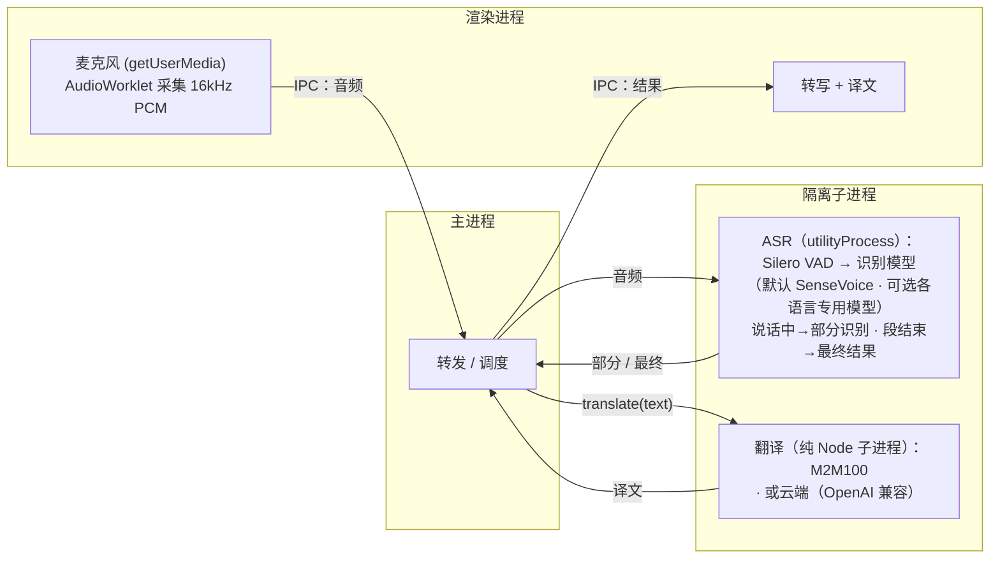

<p align="center">
  
</p>

# Realtime Translator

> 本地实时语音转写与翻译，支持 macOS、iOS 与浏览器——音频和文本都留在本机（云端翻译为可选项）。

[English](README.md) · **简体中文** · [日本語](README.ja.md) · [한국어](README.ko.md)

无需安装，立即在浏览器里试用网页版：**https://baijunjie.github.io/realtime-translator/**

## 平台

三端共享同一套核心逻辑与界面，差别在于运行方式和少数能力：

|  | macOS | iOS | 网页 |
|---|---|---|---|
| **获取方式** | 未签名 `.dmg`（[Releases](https://github.com/baijunjie/realtime-translator/releases)） | 自行从源码构建 | [浏览器打开](https://baijunjie.github.io/realtime-translator/) / 安装为 PWA |
| **识别模型** | SenseVoice + Paraformer / ReazonSpeech / Parakeet | SenseVoice | SenseVoice + Paraformer / ReazonSpeech / Parakeet |
| **本地翻译** | M2M-100 418M / 1.2B | Apple 端上翻译 | M2M-100 418M † |
| **云端翻译** | ✓ | ✓ | ✓ |
| **音频来源** | 麦克风 + 系统音频（14.2+） | 麦克风 | 麦克风 |
| **运行时** | Electron · sherpa-onnx N-API | Capacitor · 原生 C++ | 浏览器 · 单线程 WASM |
| **存储** | 应用数据文件 | Preferences | IndexedDB + Cache |

† iOS / iPadOS Safari 上不支持本地翻译（WebKit 单标签页内存无法与 ASR 同时容纳翻译模型），这些设备仅提供云端翻译。

### macOS

从 [Releases 页面](https://github.com/baijunjie/realtime-translator/releases) 下载最新的 `.dmg`（Apple Silicon），把应用拖入**应用程序**文件夹。

**未签名版本**——该 beta 未签名/未公证。首次打开时：

- 右键点击应用 →「**打开**」，然后确认；或
- 执行：`xattr -dr com.apple.quarantine "/Applications/Realtime Translator.app"`

macOS 是功能最全的一端：除麦克风外还能采集**系统音频**（Mac 正在播放的声音，需 macOS 14.2+），并额外提供更高质量的 M2M-100 1.2B 翻译模型。

### iOS

暂无预构建的安装包，需自行从源码构建：原生插件要接入 Capacitor iOS 壳，依赖 Xcode 工具链和真机（Apple 的 Translation 框架无法在模拟器运行）。详见 [`apps/ios/native-plugin/INTEGRATION.md`](apps/ios/native-plugin/INTEGRATION.md)。识别在设备端运行（SenseVoice），翻译用 Apple 的端上 Translation 框架（iOS 18+）。

### 网页

完全在浏览器里运行——无需安装、无需服务器。**在 [baijunjie.github.io/realtime-translator](https://baijunjie.github.io/realtime-translator/) 直接打开**，或安装为 PWA；首次加载后即可离线使用（模型与应用外壳都会缓存）。仅支持麦克风。

## 功能

- 实时识别中文 / 日语 / 英语 / 韩语——可自动检测，或锁定为单一语言以显著减少短句的语种误判
- 实时字幕——说话过程中显示部分结果，语音段结束后定稿
- **母语驱动**——所选语言既是界面语言也是翻译目标；其他语言统一翻成它（中文归一化为简体）。自动检测模式下，母语会被反向翻成本次会话最近一次听到的其他语言
- **本地或云端翻译**——本地模型离线运行、文本不出机器；云端为可选的 OpenAI 兼容端点（文本会发往第三方）
- 识别与翻译模型均按需下载（不打进安装包）
- 对话归档——保存一次会话，之后可重新查看
- 纯 CPU 实时运行（Apple Silicon 实测 RTF ≈ 0.03），无需 GPU

## 使用

1. **首次启动**——在引导页选择你的母语。
2. 点击**开始录音**——字幕随说话实时出现。若所选识别模型尚未下载，会先确认下载，下载转入后台、模型就绪后自动开始录音（你可以只取消本次录音，让下载继续）。
3. 在设置里选择**翻译方式**（本地模型 / 云端 / 关闭）——每行下方显示母语译文。
4. 点 **⚙ 设置**——可改母语、识别语言与识别模型、音频来源、字体大小、主题、翻译方式（及云端凭证）；「模型管理」标签页可查看、下载或删除各模型。

请求麦克风或系统音频前，应用会先在应用内说明用途，随后系统才弹出授权提示；若曾被拒绝，可一键打开对应的系统设置页。

## 模型

所有模型都在按需时从 `@rt/core` 注册表获取（不随包分发）。获取来源按端分 + 有序兜底：**macOS / iOS** 优先自托管 GitHub Release（`models-v1` 资产），失败自动回退上游 HuggingFace；**网页**因 GitHub Release 资产不发 CORS 头，直接用上游 HuggingFace（可选镜像）。每个源只试一次，全部失败才判失败。

| 模型 | 用途 | 平台 | 大小 |
|---|---|---|---|
| Silero VAD | 语音端点检测（各识别模型共用） | 全平台 | 约 0.6MB |
| SenseVoice (int8) | 多语言识别（默认） | macOS / iOS / 网页 | 约 230MB |
| Paraformer-zh (int8) | 中文识别 | macOS / 网页 | 约 220MB |
| ReazonSpeech-ja | 日语识别 | macOS / 网页 | 约 160MB |
| Parakeet-en (int8) | 英语识别 | macOS / 网页 | 约 630MB |
| M2M100-418M (q8) | 多语言翻译（默认） | macOS / 网页 | 约 640MB |
| M2M100-1.2B (q8) | 多语言翻译（更高质量） | macOS | 约 1.5GB |

iOS **不**下载翻译模型，改用 Apple 的端上翻译。中文译文统一做简体归一化（M2M100 / Apple 都不区分简繁字形）。网页端 Silero VAD 随应用同源分发，不单独下载。

## 技术架构

一个 **pnpm workspace monorepo**：共享逻辑与界面，每个平台一个包。三端都渲染**同一套 `@rt/ui`**，差别只在注入的 `AppBridge`——界面通过它触达平台能力（采音、存储、识别、翻译）。

- `packages/core`（`@rt/core`）——平台无关 TS：领域类型、设置/归档逻辑、翻译（`Translator` 接口 + 云端 + 中文简体归一化）、ASR 与本地翻译的多模型注册表，以及 `AppBridge` 契约。
- `packages/ui`（`@rt/ui`）——共享 Vue 3 界面；仅通过注入的 `AppBridge` 触达平台（不直接用 `window.api`）。
- `apps/macos`（`@rt/macos`）——Electron 应用。
- `apps/ios`（`@rt/ios`）——Capacitor 应用 + 原生插件。
- `apps/web`（`@rt/web`）——浏览器 PWA。
- `assets/`——共享品牌源（`icon.svg` / `icon.png`），各平台由它生成自己的图标格式。

转写在各端都用 [sherpa-onnx](https://github.com/k2-fsa/sherpa-onnx)（ONNX Runtime），只是运行时按端不同（见上方[平台](#平台)对比表）。本地翻译在 macOS / 网页用 [Transformers.js](https://github.com/huggingface/transformers.js) 跑 Meta M2M100（MIT），iOS 用 Apple 的 Translation 框架。二者都封装在 `@rt/core` 的接口之后——换更强的本地模型或云 API，只是新增一个实现。

在 macOS 上，ASR 跑在独立的 Electron `utilityProcess`，翻译跑在独立的纯 Node 子进程（`child_process.fork` + `ELECTRON_RUN_AS_NODE`，脱离 Chromium 的内存分配器以支撑 1.5GB 级模型推理）：重推理不阻塞 UI，原生崩溃或超大内存分配也只影响该子进程。网页上对应的隔离是每个任务一个 Web Worker；iOS 上则由原生插件承担。



*（图为 macOS 的进程划分；iOS 与网页不同——分别是原生插件 / WASM Worker，不是 Electron 进程。）*

## 开发

需要 **pnpm**。Vite + Vue 3 + Naive UI，全 TypeScript（macOS 用 electron-vite）。

```bash
pnpm install
pnpm dev                    # 跑 macOS 应用（热更新，→ @rt/macos）
pnpm --filter @rt/web dev   # 跑浏览器 PWA 开发服务器（→ @rt/web）
```

iOS 见 [`apps/ios/native-plugin/INTEGRATION.md`](apps/ios/native-plugin/INTEGRATION.md)。其他脚本：`pnpm build`、`pnpm type-check`；单包 `pnpm --filter @rt/macos <script>`（如 `clean`、`test-translate`）。

**打包（macOS）**——`pnpm dist` 构建未签名的 arm64 `.dmg` 到 `apps/macos/release/`（`pnpm dist:dir` 只生成未压缩 `.app`，调试用）。打开未签名产物见 [macOS](#macos) 小节；正式公开发布请用 Apple Developer ID 签名并公证。

**网页部署**——GitHub Actions 工作流（`.github/workflows/ci.yml` 的 `deploy-web` job）在每次推送到 `main` 且质量门禁（`check`）全绿后部署到 GitHub Pages。ASR 特意用单线程 WASM，从而无需 COOP/COEP 头，可免费托管在 Pages。

**离线测试（无需 GUI）**：

```bash
npm run test-pipeline -- test.wav   # 转写，需 16kHz 单声道
# 转换: afconvert -f WAVE -d LEI16@16000 -c 1 in.wav out.wav
npm run test-translate              # 多向翻译（首次会下载模型）
```
